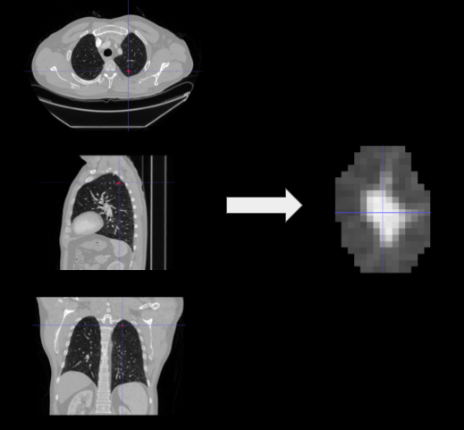

Pulmonary nodule classification in lung cancer from 3D thoracic CT scans 
==============================


This code is written by <a href=https://alexander.lundervold.com/> Alexander Selvikvåg Lundervold </a> and <a href=https://skaliy.github.io/> Satheshkumar Kaliyugarasan </a>. 

Project Organization
--------
    ├── figures            <- Generated figures
    │   
    ├── notebooks          <- Jupyter notebooks 
    │   
    ├── src                <- Source code for use in this project
    │   
    ├── .ignore            <- Local files and folder to be ignored 
    │   
    ├── README.md          <- The top-level README for developers using this project
    │
    └── environment.yml     <- Config for conda and pip  
--------

Steps to run the experiment 
------------
1. Download the processed LIDC_IDRI Version 2 data used in this project from: https://wiki.cancerimagingarchive.net/display/DOI/Standardized+representation+of+the+TCIA+LIDC-IDRI+annotations+using+DICOM

2. Run the following command with your conda environment activated: 
```
conda env update --file environment.yml
```
<b>[Optional]</b> If you want to create a new conda environment from yml file run this instead: 
```
conda env create --file environment.yml
```

3. Run: 
```
python prepare_images.py <IMAGE_PATH>
``` 

4. Go through the notebook: [1.0-classification.ipynb](https://github.com/MMIV-ML/Lung-CT-fastai-2020/blob/master/notebooks/1.0-classification.ipynb).

<b>[Note]</b> If conda environment is not showing up in Jupyter Notebook run the following lines:
```
conda activate lung-ct 
conda install jupyter nb_conda nb_conda_kernels ipykernel
python -m ipykernel install --user --name lung-ct --display-name "Python (lung-ct)"
```
 

Acknowledgement
-----------
Our work was supported by the Trond Mohn Research Foundation through the project “Computational medical imaging and machine learning – methods, infrastructure and applications" at the Mohn Medical Imaging and Visualization Center, grant number BFS2018TMT07.


